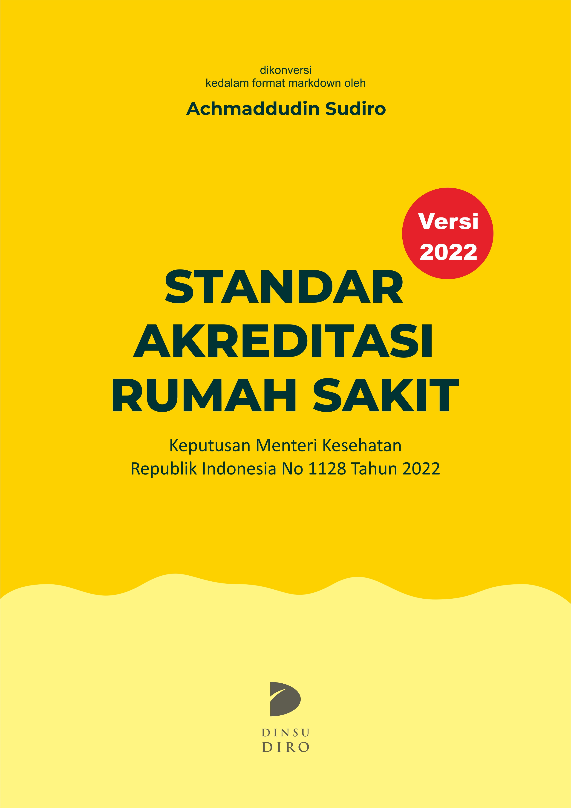

--- 
title: "Standar Akreditasi Rumah Sakit"
author: "Achmaddudin Sudiro"
date: "`r Sys.Date()`"
site: bookdown::bookdown_site
documentclass: book
bibliography: [book.bib, packages.bib]
url: https://akreditasi-rs.netlify.app/
cover-image: images/cover.jpg
description: |
  Buku elektronik Standar Akreditasi Rumah Sakit diambil dari lampiran Keputusan Menteri Kesehatan (Kepmenkes) Republik Indonesia H.K 01.07 No 1128 Tahun 2022 tentang Standar Akreditasi Rumah Sakit. Dibuat menggunakan progrram rstudio (bookdown).
link-citations: yes
github-repo: dinsudiro/StandarAkreRS
twitter-handle: din_sudiro
---

# Perkenalan {-}

Hi, Salam kenal dengan saya Achmaddudin Sudiro (Din Sudiro), anda bisa memanggil saya dengan sebutan apapun yang anda suka. 

Dalam rangka memudahkan penyelenggara layanan kesehatan, lembaga akreditasi,  akademisi, maupun masyarakat umum untuk mengakses informasi standar akreditasi rumah sakit yang tertuang dalam Keputusan Menteri Kesehatan Republik Indonesia (Kepmenkes) No. 1128 tahun 2022 tentang Standar Akreditasi Rumah Sakit, saya berinisiatif untuk mengonversi dokumen Kepmenkes tersebut kedalam format buku elektronik ini dibuat menggunakan program r-studio (bookdown).

<a href="https://akreditasi-rs.netlify.app/"></a>

Ada beberapa fitur yang dapat anda manfaatkan untuk menunjang kenyamanan anda dalam menelusuri informasi terkait akreditasi kepmenkes dalam format buku elektronik ini, seperti fitur pencarian, penyesuaian ukuran font, juga fitur unduh (format pdf). 

Saya mengharapkan anda memberikan masukan juga pandangan anda yang berharga untuk perbaikan buku elektronik ini, maupun untuk mendiskusikan hal lain. Untuk dapat menghubungi saya, Anda dapat mengirimkan pesan melalui **[E-mail](mailto:achmaddudinsudiro2@gmail.com)** , **[Twitter](https://mobile.twitter.com/din_sudiro)**, atau melalui **[LinkedIn](https://www.linkedin.com/in/din-sudiro/)**. 

Semoga buku elektronik standar akreditasi rumah sakit ini dapat dimanfaatkan dengan baik untuk membantu proses penyelenggaraan akreditasi di rumah sakit. 
Terima Kasih. 


Salam hangat,

Rumpin, 11 Mei 2022 


**Din Sudiro**

```{r include=FALSE}
# automatically create a bib database for R packages
knitr::write_bib(c(
  .packages(), 'bookdown', 'knitr', 'rmarkdown'
), 'packages.bib')
```
